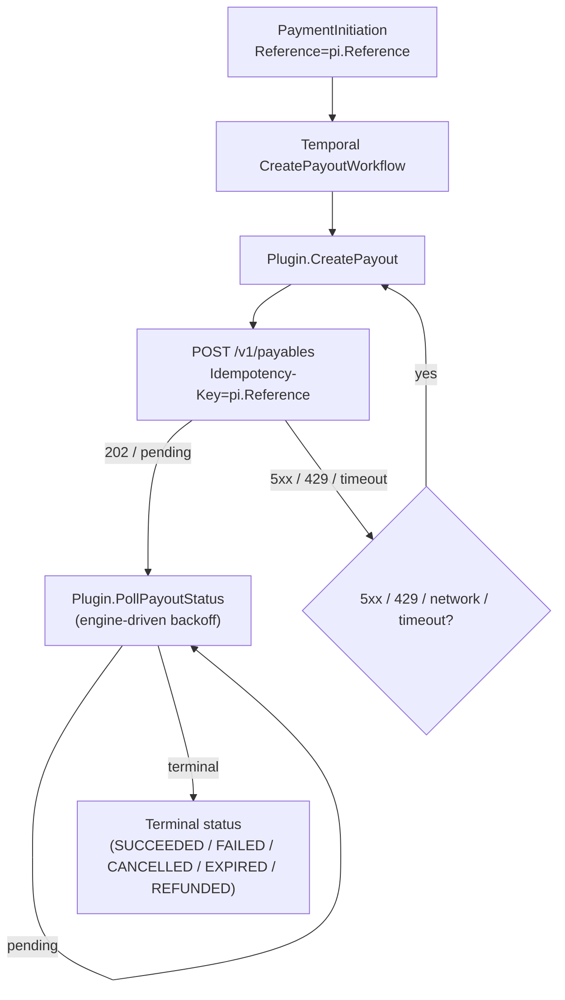

# Routable ↔ Formance Payments — field mapping

Authoritative reference for how the dedicated Routable EE connector translates Routable API objects into Formance PSP types and back.

This document is the source of truth for connector reviewers, integrators, and operators tracing a Formance Payment back to its Routable origin (or vice-versa). It is co-located with the code so the mapping table and the implementation do not drift.

> Symbols used in this doc
>
> - **R** — a Routable API field (REST/JSON, `snake_case`)
> - **F** — a Formance PSP field (Go struct, `CamelCase`)
> - `→` — write direction (Routable → Formance, sync path)
> - `←` — write direction (Formance → Routable, payout/transfer initiation)

---

## 1. Connector configuration

Defined in [`config.go`](config.go), exposed through [`/openapi/v3/v3-connectors-config.yaml`](../../../openapi/v3/v3-connectors-config.yaml) as `V3RoutableConfig`.

| Field | Required | Default | Purpose |
|---|---|---|---|
| `apiKey` | yes | — | Routable Bearer token, sent as `Authorization: Bearer <apiKey>` on every request. |
| `endpoint` | no | `https://api.routable.com` | API root. Use `https://api.sandbox.routable.com` for the sandbox. |
| `actingTeamMember` | **no** | `""` | Default Routable team member ID for `POST /v1/payables`. Optional at the connector level: callers may override (or supply) it per-request via the metadata key [`com.routable.spec/acting_team_member`](#5-payment-initiation-metadata-keys-payouts--transfers). If neither config nor metadata sets it, payable creation fails with a clear validation error before the request is sent. |
| `pollingPeriod` | no | `30m` | Polling cadence for sync tasks (accounts, balances, external accounts, payments). Minimum 20 minutes. |

### 1.1 Concurrency & immutability

The `Plugin` struct has four fields (`name`, `logger`, `client`, `config`), all set in [`New`](plugin.go) and never written afterwards. The `client` and the underlying `httpwrapper.Client` are themselves stateless beyond the HTTP connection pool. The engine may invoke any capability (`FetchNext*`, `CreateTransfer`, `CreatePayout`, `Poll*Status`) concurrently across worker goroutines without synchronisation: the plugin is safe for concurrent access by construction.

Pagination state (`paymentsState`, `pageState`) lives entirely in the engine-managed checkpoint passed in via `req.State` and returned via `resp.NewState`; the plugin keeps no in-memory cycle accumulators, so a worker crash mid-cycle resumes deterministically from the last persisted checkpoint with no double-billed or skipped rows. Per-page slices are bounded by `req.PageSize` (≤ `PAGE_SIZE = 100`).

### 1.2 Credential validation

[`Install`](plugin.go) issues a tiny `GET /v1/settings/accounts?page=1&page_size=1` probe before returning the workflow. A bad `apiKey` (401/403) surfaces as an install-time error rather than as the first FETCH_ACCOUNTS run failing later in the worker — at 200k tx/wk the operator gets the failure feedback during the install API call instead of after the engine has scheduled thousands of doomed activities.

---

## 2. Capabilities and workflow

Declared in [`capabilities.go`](capabilities.go) and [`workflow.go`](workflow.go).

| Capability | Routable endpoint(s) | Triggered by |
|---|---|---|
| `CAPABILITY_FETCH_ACCOUNTS` | `GET /v1/settings/accounts` | Periodic `TASK_FETCH_ACCOUNTS` |
| `CAPABILITY_FETCH_BALANCES` | `GET /v1/settings/accounts/{id}` | Periodic `TASK_FETCH_BALANCES` (downstream of accounts) |
| `CAPABILITY_FETCH_EXTERNAL_ACCOUNTS` | `GET /v1/companies` | Periodic `TASK_FETCH_EXTERNAL_ACCOUNTS` |
| `CAPABILITY_FETCH_PAYMENTS` | `GET /v1/payables` + `GET /v1/receivables` | Periodic `TASK_FETCH_PAYMENTS` |
| `CAPABILITY_CREATE_TRANSFER` | `POST /v1/payables` | `CreateTransfer` engine workflow |
| `CAPABILITY_CREATE_PAYOUT` | `POST /v1/payables` | `CreatePayout` engine workflow |

Webhooks (`CREATE_WEBHOOKS`, `TRANSLATE_WEBHOOKS`) and `CreateBankAccount` / `ReverseTransfer` / `ReversePayout` are deliberately deferred to follow-up PRs and inherit `ErrNotImplemented` from [`base_plugin.go`](../../../internal/connectors/plugins/base_plugin.go).

---

## 3. Sync mappings (Routable → Formance)

### 3.1 Settings account → `PSPAccount` (internal)

Implemented in [`accounts.go`](accounts.go) (`settingsAccountToPSPAccount`).

| F — `models.PSPAccount` | R — `Account` | Notes |
|---|---|---|
| `Reference` | `id` | Stable Routable identifier (e.g. `acc_…`). |
| `Name` | `name` | Set when non-empty. |
| `CreatedAt` | `created_at` | Forwarded as-is (Routable always populates it on settings accounts). |
| `DefaultAsset` | `currency_code` | Formatted via [`go-libs/v3/currency.FormatAsset`](https://github.com/formancehq/go-libs) (e.g. `USD/2`). Omitted when Routable returns no currency. |
| `Metadata` | `object`, `type`, `is_valid`, `currency_code`, `type_details.{account_type,bank_name,account_number,routing_number}` | All keys namespaced under `com.routable.spec/`. See [`metadata.go`](metadata.go) → `settingsAccountMetadata`. |
| `Raw` | full JSON | Verbatim Routable response, kept for forensics. |

### 3.2 Settings account → `PSPBalance`

Implemented in [`balances.go`](balances.go) (`accountToBalance`).

| F — `models.PSPBalance` | R — `Account.type_details` | Notes |
|---|---|---|
| `AccountReference` | `id` | Same reference as the parent `PSPAccount`. |
| `Asset` | `currency_code` | Defaults to `USD` when absent (Routable historically omits it on balance-only accounts). |
| `Amount` | `available_amount` | Decimal string converted to minor units via [`amounts.go`](amounts.go) (`toMinorUnits`, half-up rounding). |
| `CreatedAt` | `time.Now().UTC()` | Routable does not expose a `balance_updated_at`; we stamp the read time. |

> Pending balances are not surfaced as a second `PSPBalance`. The Formance balance model represents one snapshot per `(account, asset)` pair, and Routable's `available_amount` is the canonical operational signal. If you need the pending figure, it is preserved in `PSPAccount.Metadata` under `com.routable.spec/...` keys.

### 3.3 Company → `PSPAccount` (external)

Implemented in [`external_accounts.go`](external_accounts.go) (`companyToPSPAccount`).

| F — `models.PSPAccount` | R — `Company` | Notes |
|---|---|---|
| `Reference` | `id` | Routable company ID (e.g. `co_…`). Used as the `DestinationAccountReference` on payables. |
| `Name` | `display_name` ?? `business_name` | Falls back to `business_name` when `display_name` is empty. |
| `CreatedAt` | `created_at` | Forwarded as-is. |
| `Metadata` | `object`, `type`, `status`, `country_code`, `is_vendor`, `is_customer`, `is_archived`, `external_id`, `business_name`, `display_name`, `registered_address.{line_1,line_2,city,state,postal_code,country}` | See [`metadata.go`](metadata.go) → `companyMetadata`. |
| `Raw` | full JSON | Verbatim Routable response. |

> **No N+1.** Unlike the legacy Generic-Connector adapter (`connector-routable`), we do **not** fan out to `GET /v1/companies/{id}/payment-methods` per row during list. Payment-method resolution happens on demand at payable-creation time only.

### 3.4 Payable → `PSPPayment` (PAYOUT)

Implemented in [`payments.go`](payments.go) (`payableToPSPPayment`).

| F — `models.PSPPayment` | R — `Payable` | Notes |
|---|---|---|
| `Reference` | `id` | Routable payable ID (e.g. `pa_…`). |
| `CreatedAt` | `created_at` | Forwarded as-is. |
| `Type` | constant `PAYMENT_TYPE_PAYOUT` | All Routable payables are money-out flows. Overridden to `PAYMENT_TYPE_TRANSFER` only when the row was created via `CreateTransfer` (see [`transfers.go`](transfers.go)). |
| `Amount` | `amount` × `precision(currency_code)` | Decimal → minor units. Unsupported currencies cause the row to be skipped with a log line. |
| `Asset` | `currency_code` | `USD/2`, `EUR/2`, `KWD/3`, … |
| `Scheme` | `delivery_method` | Mapped via [`scheme.go`](scheme.go) → `deliveryMethodToScheme` (`ach*` → `PAYMENT_SCHEME_ACH`, everything else → `PAYMENT_SCHEME_OTHER`). |
| `Status` | `status` | Mapped via [`status.go`](status.go) → `payableStatus`. See [§4](#4-status-mapping). |
| `SourceAccountReference` | `withdraw_from_account.id` | Routable settings account ID (matches a `PSPAccount` of internal type). |
| `DestinationAccountReference` | `pay_to_company.id` | Routable company ID (matches a `PSPAccount` of external type). |
| `Metadata` | `type`, `delivery_method`, `status`, `external_id`, `memo`, `reference`, plus the correlation aliases `payment_initiation_reference` (= `external_id`) and `payable_id` (= the Routable UUID) | See [`metadata.go`](metadata.go) → `payableMetadata`. The aliases make the Transfer ↔ Payment link discoverable without grepping for Routable-specific keys; see [§5.5](#55-correlating-a-transfer-paymentinitiation-with-the-synced-payment). |
| `Raw` | full JSON | Verbatim Routable response. |

### 3.5 Receivable → `PSPPayment` (PAYIN)

Implemented in [`payments.go`](payments.go) (`receivableToPSPPayment`). Mirror of §3.4 with source/destination flipped.

| F — `models.PSPPayment` | R — `Receivable` | Notes |
|---|---|---|
| `Type` | constant `PAYMENT_TYPE_PAYIN` | |
| `SourceAccountReference` | `pay_from_company.id` | Inbound counterparty (company ID). |
| `DestinationAccountReference` | `deposit_to_account.id` | Settings account ID. |
| All other fields | Same shape as §3.4 (`amount`, `currency_code`, `delivery_method`, `status`, `created_at`, …) | See `receivableMetadata` in [`metadata.go`](metadata.go) for the metadata key set. Receivables also carry the `payment_initiation_reference` and `payable_id` aliases described in [§5.5](#55-correlating-a-transfer-paymentinitiation-with-the-synced-payment). |

### 3.6 Pagination & state

Defined in [`state.go`](state.go) (`pageState`) and [`payments.go`](payments.go) (`paymentsState`). Persisted opaquely as JSON between fetch cycles.

| Resource | Cursor | Filters sent to Routable |
|---|---|---|
| Settings accounts | `{ page }` (1-indexed) | `page`, `page_size` |
| Companies | `{ page }` | `page`, `page_size` |
| Payments | `{ phase: "" \| "receivables", page, cycleLowerBound, cycleMaxSeen }` | `page`, `page_size`, `status_changed_at.gte=cycleLowerBound` |

The payments fetcher walks payables, then receivables, then closes the cycle and promotes its watermark for the next cycle. The cursor enforces three invariants the engine relies on at 200k/wk volume:

1. **Resumable** — `paymentsState` is opaque JSON checkpointed by the engine after every page; a worker crash mid-cycle resumes at the next page with the same `cycleLowerBound` as before, so no row is double-billed and no row is silently dropped.
2. **Lossless** — `cycleLowerBound` is **immutable for the full duration of a cycle**. Mutating it mid-cycle (the legacy `lastSeenAt` design) caused page=2 to use a tighter floor than page=1, dropping any row whose `status_changed_at` landed between the two timestamps but whose page was paginated late. `cycleMaxSeen` is a write-only accumulator that never drives a request; it is promoted to the next cycle's `cycleLowerBound` only on cycle commit, and only when **non-zero** (an empty cycle preserves the previous floor — never regress to epoch).
3. **Tiebreaker** — Routable's `status_changed_at.gte` filter is inclusive, so rows whose timestamp equals the floor get re-emitted at every cycle boundary. The engine framework dedupes by `PSPPayment.Reference`, so this is wasted traffic but never a correctness problem. A `(status_changed_at, id)` tiebreaker would eliminate the replay; tracked as a follow-up.

Legacy `lastSeenAt` state on disk is migrated to `cycleLowerBound` on first decode (see [`decodePaymentsState`](payments.go)) so existing connector installs roll forward without operator intervention.

---

## 4. Status mapping

Implemented in [`mappers/status.go`](mappers/status.go) (`PayableStatus`).

| Routable `status` | Formance `models.PaymentStatus` |
|---|---|
| `draft`, `ready_to_send`, `pending`, `scheduled`, `initiated`, `processing`, `in_transit`, `awaiting_delivery` | `PAYMENT_STATUS_PENDING` |
| `completed`, `paid`, `delivered` | `PAYMENT_STATUS_SUCCEEDED` |
| `failed`, `returned`, `nsf` | `PAYMENT_STATUS_FAILED` |
| `stopped`, `canceled`, `cancelled`, `voided` | `PAYMENT_STATUS_CANCELLED` |
| `expired` | `PAYMENT_STATUS_EXPIRED` |
| anything else (or empty) | `PAYMENT_STATUS_UNKNOWN` |

Comparison is case-insensitive and trims whitespace.

`isTerminalStatus` in the same file controls when [`PollPayoutStatus`/`PollTransferStatus`](payouts.go) stop polling — it returns true for `SUCCEEDED`, `FAILED`, `CANCELLED`, `EXPIRED`, and `REFUNDED`.

---

## 5. Payment initiation metadata keys (payouts + transfers)

`CreatePayout` and `CreateTransfer` translate a `PSPPaymentInitiation` (defined in [`internal/models/payment_initiations.go`](../../../internal/models/payment_initiations.go)) into a Routable `POST /v1/payables` body. The implementation lives in [`payable_create.go`](payable_create.go) (`initiatePayable`), shared by both flows.

Most of the request body is derived from the structured `PSPPaymentInitiation` fields. A small set of Routable-specific knobs is exposed via metadata; every key is namespaced under `com.routable.spec/`.

### 5.1 Routable-specific metadata keys

All keys are defined as constants in [`mappers/metadata.go`](mappers/metadata.go) so producers can reference them without string typos.

| Metadata key | Const | Required | Default | Maps to Routable field | Purpose |
|---|---|---|---|---|---|
| `com.routable.spec/type` | `MetadataKeyType` | no | `ach` | `type` | Payable rail (`ach`, `wire`, `check`, `international`, `external`, `vendor_choice`). |
| `com.routable.spec/delivery_method` | `MetadataKeyDeliveryMethod` | no | `ach_standard` | `delivery_method` | Specific delivery option (`ach_standard`, `ach_same_day`, `wire`, `check`, …). Must be compatible with `type`. |
| `com.routable.spec/acting_team_member` | `MetadataKeyActingTeamMember` | conditional¹ | config `actingTeamMember` | `acting_team_member` | Routable team member ID initiating the payable. |
| `com.routable.spec/external_id` | `MetadataKeyExternalID` | no | `""` | `external_id` | Caller-supplied external reference (idempotent lookup key on Routable's side). |
| `com.routable.spec/line_item_description` | `MetadataKeyLineDescription` | no | `PSPPaymentInitiation.Description`, then `"Payment <reference>"` | `line_items[0].description` | Description on the auto-generated single-line item. Required by Routable v1; we always emit a non-empty value. |

> `com.routable.spec/memo` is read-only metadata on synced payables/receivables (populated from the Routable response). Routable's v1 `POST /v1/payables` rejects `memo` as an unknown field, so we do not forward this key on create. Use `com.routable.spec/line_item_description` for the message that ends up on the payable.

¹ `acting_team_member` must be resolvable at request time — either from the connector config, this metadata key, or both. The client validates and returns `create payable: acting_team_member is required` before any HTTP call when neither is set.

### 5.2 Static body fields (always present)

| Routable field | Source |
|---|---|
| `pay_to_company` | `PSPPaymentInitiation.DestinationAccount.Reference` |
| `withdraw_from_account` | `PSPPaymentInitiation.SourceAccount.Reference` |
| `amount` | `PSPPaymentInitiation.Amount` (minor units) → decimal string via `fromMinorUnits` ([`amounts.go`](amounts.go)) |
| `currency_code` | `PSPPaymentInitiation.Asset` (e.g. `USD/2` → `USD`) |
| `line_items` | Single line item with `unit_price = amount = total`, `quantity = 1`, and a non-empty `description` (see metadata table for resolution order) |
| `send_on` | Always emitted; `null` means "send immediately" (Routable's v1 schema requires the field even when sending now) |
| `reference` | `PSPPaymentInitiation.Reference` (also forwarded as the `Idempotency-Key` HTTP header) |

### 5.3 Idempotency

`PSPPaymentInitiation.Reference` is sent as the `Idempotency-Key` HTTP header to `POST /v1/payables`. Routable returns the original payable on retries with the same key, which is exactly the behaviour the engine's create-then-poll workflow relies on. Unlike the legacy Generic-Connector adapter, we **do not** strip the idempotency key from the response: native Formance plugin paths do not perform the `ParentReference` swap that caused duplicate `Payment` rows in the Generic flow.

### 5.4 Response handling

Routable's `POST /v1/payables` answers in two distinct shapes; the plugin branches on the **HTTP status code**, not on the body, because a 202 echoes only `{id, status: pending}` and trying to map it as a complete payable would surface as a misleading `unsupported currency ""` error.

| Routable response | Plugin engine response | Behaviour |
|---|---|---|
| `202 Accepted` (async) — body is `{id, status: pending}` | `PollingPayoutID` / `PollingTransferID` = Routable payable ID; no `Payment` field | Engine schedules `PollPayoutStatus`/`PollTransferStatus` against `GET /v1/payables/{id}` until terminal. No mapping is attempted on the half-empty body. |
| `201 Created` (sync) with terminal status (`completed`, `failed`, `cancelled`, `expired`) | `Payment` populated, no polling ID | Workflow ends immediately with the terminal payment. |
| `201 Created` (sync) with non-terminal status (`pending`, `processing`, …) | `PollingPayoutID` / `PollingTransferID` = `Payment.Reference` | Engine schedules polling; the initial sync mapping is discarded but its `Reference` carries forward as the polling token. |

`PollPayoutStatus` (and the shared `pollPayableStatus` it delegates to) treats `404 Not Found` as a transient state (eventual consistency after `202 Accepted`) and asks the engine to retry, instead of failing the workflow. See [`payouts.go`](payouts.go) and [`client/client.go`](client/client.go) (`ErrPayableNotFound`).

### 5.5 Correlating a Transfer (PaymentInitiation) with the synced Payment

When you initiate a payable through Formance, two distinct rows land in the database:

- A `PaymentInitiation` (the **Transfer** in the Console) keyed by `pi.Reference` — the user-supplied string like `payout-acmecorp-20260506-172725`.
- A `PSPPayment` (the **Payment** / **Transaction** in the Console) keyed by Routable's payable UUID like `652e0807-02ed-4546-848f-56babc66ec99`.

Both are intentional: the PI captures the user's intent, the Payment captures Routable's record. They are linked at the engine level via the `payment_initiation_related_payments` table, populated by [`StoragePaymentInitiationsRelatedPaymentsStore`](../../../internal/connectors/engine/activities/storage_payment_initiations_related_payments_store.go). The connector itself does not own this relationship — it just emits clean PSP types and lets the engine link them.

**Three correlation paths**, in increasing order of indirection:

1. **Engine API** (canonical):
   ```bash
   curl "$ROOT/v3/payment-initiations/$(jq -rn --arg s "$PI_ID" '$s | @uri')/payments" \
     | jq '.cursor.data[] | {reference, status}'
   ```
   Returns every Payment ever linked to the given PI.

2. **Payment-side metadata** (no API join needed):
   ```bash
   curl "$ROOT/v3/payments" \
     | jq --arg cid "$ROUTABLE_CONNECTOR_ID" \
          '.cursor.data[] | select(.connectorID==$cid)
           | { payment_ref: .reference,
               pi_ref: .metadata."com.routable.spec/payment_initiation_reference",
               payable_id: .metadata."com.routable.spec/payable_id" }'
   ```
   Every synced Payment carries:
   - `com.routable.spec/payable_id` — the Routable UUID (mirrors `Payment.Reference`). Always present.
   - `com.routable.spec/payment_initiation_reference` — the originating PI reference. **Present only when we initiated the payable** (Routable's `external_id` field is populated). For payables created in Routable's UI or by another integration, this key is absent.
   - `com.routable.spec/external_id` — the same value as `payment_initiation_reference`, kept under Routable's wire vocabulary for backwards compatibility.

3. **PI-side raw lookup** (when you only have the Routable UUID and want the originating PI ref): scan the Payment's metadata as in (2), or hit `/v3/payments/{id}` directly.

The metadata aliases are populated by [`PayableMetadata`/`ReceivableMetadata`](mappers/metadata.go); the constants `MetadataKeyPaymentInitiationReference` and `MetadataKeyRoutablePayableID` are stable contract.

#### Payout lifecycle under retries



Retries on 5xx / 429 / network / timeout are handled by the engine's standard backoff (`--temporal-rate-limiting-retry-delay` floor); Routable's `RateLimit` / `RateLimit-Policy` headers are emitted on every response and can be honoured by a future shared rate-limit parser in `httpwrapper` (see follow-up roadmap in §6).

### 5.6 Transfers vs Payments — what shows up where

| List | Source | Origin scope |
|---|---|---|
| **Transfers** (`/v3/payment-initiations`) | `PaymentInitiation` rows | **Formance-initiated only**. A row exists here only if someone called `POST /v3/payment-initiations`, by definition. |
| **Payments / Transactions** (`/v3/payments`) | `Payment` rows fed by `FetchNextPayments` | **Comprehensive** — every Routable payable and receivable observed during sync, regardless of origin (Formance UI, Routable UI, third-party integration, …). |

If you want the "all Routable payables, regardless of origin" view that some operators expect under Transfers, it lives under Payments today:

```bash
curl "$ROOT/v3/payments" \
  | jq --arg cid "$ROUTABLE_CONNECTOR_ID" \
       '.cursor.data[] | select(.connectorID==$cid and .type=="PAYOUT")
        | { reference, status, amount, asset,
            pi_ref: .metadata."com.routable.spec/payment_initiation_reference" }'
```

Rows whose `pi_ref` is `null` were created outside Formance (Routable UI or another integration); rows where it is set were initiated through Formance.

> **Forward-looking note (not in this PR).** Synthesizing a `PaymentInitiation` for every payable observed during sync — so Routable-UI-initiated payables also appear under Transfers — would require an engine-contract extension: a new `PaymentInitiations []PSPPaymentInitiation` field on [`FetchNextPaymentsResponse`](../../../internal/models/plugin_psp.go) and a new engine activity to upsert those rows from a fetch workflow. That has cross-connector implications (every PSP plugin returning PIs from sync gets new semantics) and is intentionally out of scope here. If revisited, this PR's discussion captures the rationale for not doing it plugin-only.

---

## 6. Ops capacity & cost model

The connector is built for sustained throughput of ~200,000 transactions per week (~28.6k/day, ~20/min steady, bursty up to ~60/min). The numbers below are estimates for capacity planning, **not SLAs**. Confirm with `@formancehq/backend` and your Temporal namespace metrics before sizing for go-live.

### 6.1 Routable RPS budget

| Source | Rate (steady) | Notes |
|---|---|---|
| `POST /v1/payables` (createPayout / createTransfer) | ~20/min | One per payment-initiation. Idempotency-Key keyed on `pi.Reference`. |
| `GET /v1/payables/{id}` (PollPayoutStatus) | ~60/min | Assume ~3 polls/payment until terminal × 20 payments/min. |
| `GET /v1/payables` + `GET /v1/receivables` (FETCH_PAYMENTS pagination) | ~3.5/min | ~70 pages × 3 cycles/h ÷ 60. |
| `GET /v1/settings/accounts` + `GET /v1/companies` (FETCH_ACCOUNTS / FETCH_EXTERNAL_ACCOUNTS) | ~0.2/min | A few pages every 20-min cycle. |
| **Total** | **~80-100 req/min steady, peak ~200 req/min** | Must fit inside Routable's published rate limit envelope (see §6.1.1). Webhooks (§6.4) eliminate ~75% of the poll traffic. |

`PAGE_SIZE = 100` (Routable's documented max) keeps pagination requests at a minimum. Polling cadence is bounded by `MinimumPollingPeriod = 20m` ([`internal/connectors/plugins/sharedconfig/polling_period.go`](../../../internal/connectors/plugins/sharedconfig/polling_period.go)); we cannot poll faster without an engine-level change (§6.4).

#### 6.1.1 Rate-limit envelope (informational)

Routable returns the IETF draft `RateLimit` and `RateLimit-Policy` headers on every response (documented at <https://developers.routable.com/reference/create-payable>). They advertise two policies: `"fetch"` for most endpoints (60s window) and `"change"` for write-heavy endpoints such as `POST /v1/payables`. Routable does **not** send RFC 9110 `Retry-After`. This connector does not parse those headers today; on 429 / 5xx the engine applies its default backoff via `--temporal-rate-limiting-retry-delay`. Surfacing the hint into Temporal's `NextRetryDelay` is tracked as a follow-up across `httpwrapper` (shared) — see the follow-up roadmap.

### 6.2 Temporal workflow / activity volume

Each payment-initiation drives one `CreatePayoutWorkflow` plus one `PollPayoutStatus` schedule until terminal. Each periodic capability drives one workflow per cycle, with one activity per page.

| Source | Workflow starts / day | Activity executions / day |
|---|---|---|
| `CreatePayoutWorkflow` | ~28,571 | ~6 activities each ⇒ ~171k |
| `PollPayoutStatus` | ~28,571 | ~4 polls/payment ⇒ ~114k |
| `FetchPaymentsWorkflow` | 72 (one per cycle, 20m period) | ~70 pages × ~4 activities ⇒ ~20k |
| `FetchAccounts` / `FetchBalances` / `FetchExternalAccounts` | ~216 total | ~650 |
| **Daily total** | **~57.4k** | **~306k** |
| **Weekly total** | **~402k** | **~2.14M** |
| **Monthly total** | **~1.72M** | **~9.18M** |

### 6.3 Temporal Cloud Action estimate

Temporal Cloud bills by Action (workflow events: start, completion, activity scheduled/completed, timer fired, signal, …). Empirically a typical Payments workflow emits ~3.5 Actions per workflow start and ~2 per activity execution.

- Per day: 57.4k × 3.5 + 306k × 2 ≈ **0.81M Actions**
- Per week: ≈ **5.7M Actions**
- Per month: ≈ **24.4M Actions**

At Temporal Cloud's public list pricing of ~$25 per 1M Actions (subject to plan/discount), this lands at **~$600/month** for the connector at full 200k/wk volume — not including the latency-SLA / namespace baseline. Webhooks (§6.4) cut the `PollPayoutStatus` line by ~75-80%, saving roughly $200/month and ~5M Actions/month on their own.

### 6.4 Levers

| Knob | Effect | Status |
|---|---|---|
| `pollingPeriod` config (default 30m, floor 20m) | Doubling halves periodic-fetch Actions; trades freshness for cost. | Operator-facing today. |
| `PAGE_SIZE` (currently 100) | Doubling halves pagination requests linearly. | At Routable's documented max. |
| Webhooks for `payable.status_updated` | Replaces ~80% of `PollPayoutStatus` traffic with push events. ~5M Actions/month and ~60 req/min savings at full volume. | **Follow-up PR.** |
| Per-capability schedules | Run `FETCH_ACCOUNTS` / `FETCH_BALANCES` / `FETCH_EXTERNAL_ACCOUNTS` at 1h while keeping `FETCH_PAYMENTS` at 20m — cuts ~75% of their Actions. | **Follow-up engine PR** (touches [`sharedconfig/polling_period.go`](../../../internal/connectors/plugins/sharedconfig/polling_period.go) and the workflow scheduler). |
| Honour `RateLimit` / `Retry-After` hints in Temporal `NextRetryDelay` | Reduces 429 churn and respects Routable's documented quota windows precisely instead of falling back to the engine's static delay. Shared infra (every connector benefits). | **Follow-up PR** on `internal/connectors/httpwrapper` + `plugins/errors.go` + `engine/activities/errors.go`. |

---

## 7. Quick-reference index

| Concern | File |
|---|---|
| Plugin shim, `ErrNotYetInstalled` guards | [`plugin.go`](plugin.go) |
| Capabilities matrix | [`capabilities.go`](capabilities.go) |
| Periodic task graph | [`workflow.go`](workflow.go) |
| Config schema (`apiKey`, `endpoint`, `actingTeamMember`, `pollingPeriod`) | [`config.go`](config.go) |
| State / cursors | [`state.go`](state.go), [`payments.go`](payments.go) |
| Settings accounts → `PSPAccount` (internal) | [`accounts.go`](accounts.go) + [`mappers/account.go`](mappers/account.go) |
| Settings account → `PSPBalance` | [`balances.go`](balances.go) + [`mappers/balance.go`](mappers/balance.go) |
| Companies → `PSPAccount` (external) | [`external_accounts.go`](external_accounts.go) + [`mappers/external_account.go`](mappers/external_account.go) |
| Payables/receivables → `PSPPayment` | [`payments.go`](payments.go) + [`mappers/payable.go`](mappers/payable.go), [`mappers/receivable.go`](mappers/receivable.go) |
| Create payout (Routable payable) | [`payouts.go`](payouts.go), [`payable_create.go`](payable_create.go) |
| Create transfer (Routable payable, type override) | [`transfers.go`](transfers.go), [`payable_create.go`](payable_create.go) |
| Status mapping | [`mappers/status.go`](mappers/status.go) |
| Scheme mapping | [`mappers/scheme.go`](mappers/scheme.go) |
| Decimal ↔ minor units | [`mappers/amounts.go`](mappers/amounts.go) |
| Metadata key constants & helpers | [`mappers/metadata.go`](mappers/metadata.go) |
| Routable HTTP client (interface + impl) | [`client/client.go`](client/client.go) |
| Routable request/response shapes | [`client/types.go`](client/types.go) |
| Routable error envelope | [`client/error.go`](client/error.go) |

---

## 8. References

- Routable API docs: <https://developers.routable.com/reference>
- Routable idempotency: <https://developers.routable.com/docs/idempotency-keys>
- Formance PSP types: [`internal/models/`](../../../internal/models/)
  - [`accounts.go`](../../../internal/models/accounts.go) — `PSPAccount`
  - [`balances.go`](../../../internal/models/balances.go) — `PSPBalance`
  - [`payments.go`](../../../internal/models/payments.go) — `PSPPayment`
  - [`payment_initiations.go`](../../../internal/models/payment_initiations.go) — `PSPPaymentInitiation`
  - [`capabilities.go`](../../../internal/models/capabilities.go) — `Capability` enum
  - [`payment_scheme.go`](../../../internal/models/payment_scheme.go) — `PaymentScheme` enum
  - [`payment_status.go`](../../../internal/models/payment_status.go) — `PaymentStatus` enum
- Plugin contract: [`internal/connectors/plugins/plugin.go`](../../../internal/connectors/plugins/plugin.go), [`base_plugin.go`](../../../internal/connectors/plugins/base_plugin.go)
- Registry & EE/CE gating: [`internal/connectors/plugins/registry/`](../../../internal/connectors/plugins/registry/)
