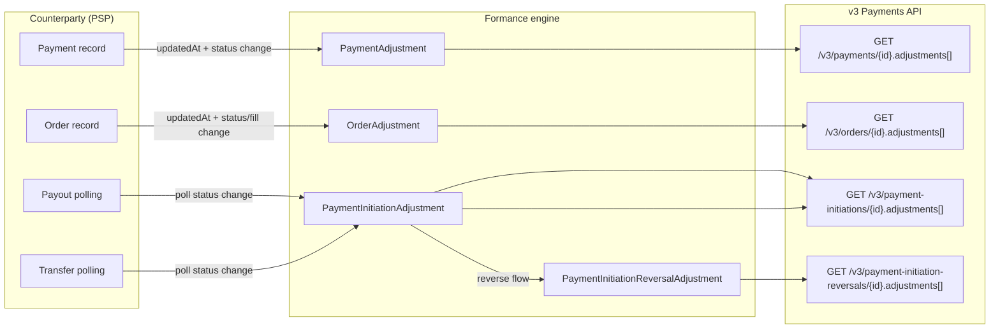

# Universal Connector — Adjustments (v1)

> Companion: [`data-model.md`](data-model.md),
> [`state-machines.md`](state-machines.md),
> [`universal-events.md`](universal-events.md).

Adjustments are how Formance models **changes over time** on long-lived
entities (payments, orders, payment-initiations). They are the bridge
between the plugin's "current state" view of the world and the engine's
auditable "this is what happened" view.

This document explains the four adjustment shapes that exist in the
codebase, who emits them, and what counterparty implementers actually need
to do.

## TL;DR for counterparty implementers

You **never POST adjustments to Formance**. You serve current state.
Formance derives the adjustment history.

To trigger a new adjustment entry, do exactly one thing:

| Entity                    | Bump…                                                                  |
|---------------------------|------------------------------------------------------------------------|
| Payment                   | `updatedAt` and change `status` and/or `amount`                        |
| Order                     | `updatedAt` and change any of `status`, `baseQuantityFilled`, `fee`, `feeAsset` |
| Payment initiation (out)  | re-serve the latest payment from `GET /v1/payouts/{id}` / `…/transfers/{id}` |

That's it. The engine handles dedup via canonical adjustment IDs.

## The four adjustment shapes



### 1. PaymentAdjustment — inbound, derived from `PSPPayment`

Source: [`PaymentAdjustment`](../../../../models/payment_adjustments.go).

**Producer**: the engine, on every `FetchNextPayments` (or
`TranslateWebhook`-delivered) observation that has a different
`(reference, status)` tuple from the previously stored one.
**Consumer**: `GET /v3/payments/{id}` returns the full adjustment array,
each entry snapshotting the PSP `Raw` payload at that moment.
**Counterparty contract**: keep re-serving the latest `Payment` for the
same `reference`, with `updatedAt` strictly increasing whenever any of
`status` / `amount` / `metadata` / scheme-related fields change.

The adjustment dedup key is `(payment.reference, status, amount)`. Same
tuple twice ⇒ no new adjustment is created.

### 2. OrderAdjustment — inbound, derived from `PSPOrder`

Source: [`OrderAdjustment` + `OrderAdjustmentID`](../../../../models/orders.go).

**Producer**: the engine, identical pattern to `PaymentAdjustment` but the
dedup key is wider:
`(orderID, reference, status, baseQuantityFilled, fee, feeAsset)`.
The wider key matters because an order can stay in `PARTIALLY_FILLED` for
many fills, and each fill is a new adjustment even though the status
doesn't change.

**Counterparty contract**: keep re-serving the latest `Order`, with
`updatedAt` strictly increasing whenever **any** of those tracked fields
change. A pure metadata change without a tracked-field change does NOT
produce an adjustment (deliberately — the engine treats metadata as a
labelling overlay, not a state transition).

### 3. PaymentInitiationAdjustment — outbound, produced by the engine

Source:
[`PaymentInitiationAdjustment`](../../../../models/payment_initiation_adjustments.go),
status enum
[`PaymentInitiationAdjustmentStatus`](../../../../models/payment_initiation_adjustments_status.go).

**Producer**: the engine, on every state transition of an outbound
transfer or payout. The lifecycle is:

```
WAITING_FOR_VALIDATION
  └─> SCHEDULED_FOR_PROCESSING
       └─> PROCESSING
            ├─> PROCESSED
            ├─> FAILED
            └─> REJECTED
```

Each transition is one engine-side adjustment. **Counterparty does NOT see
or emit these** — it only serves the latest payment status from
`GET /v1/payouts/{id}` or `GET /v1/transfers/{id}`. The engine's mapping
from PSP `PaymentStatus` to `PaymentInitiationAdjustmentStatus` lives in
[`FromPaymentDataToPaymentInitiationAdjustment`](../../../../models/payment_initiation_adjustments_status.go)
(line 128). The relevant rows:

| PSP `PaymentStatus`                                                                             | Engine `PaymentInitiationAdjustmentStatus`     |
|-------------------------------------------------------------------------------------------------|------------------------------------------------|
| `PENDING`, `AUTHORISATION`                                                                      | `PROCESSING`                                   |
| `SUCCEEDED`, `CAPTURE`, `REFUND_REVERSED`, `DISPUTE_WON`                                        | `PROCESSED`                                    |
| `CANCELLED`, `CAPTURE_FAILED`, `EXPIRED`, `FAILED`, `DISPUTE_LOST`                              | `FAILED`                                       |
| `REFUNDED`                                                                                      | `REVERSED`                                     |
| `REFUNDED_FAILURE`                                                                              | `REVERSE_FAILED`                               |

Returning a payment with `status = SUCCEEDED` from `GET /v1/payouts/{id}`
therefore drives the engine to write a `PROCESSED` adjustment and stop the
poll.

### 4. PaymentInitiationReversalAdjustment — outbound, reversal lifecycle

Source:
[`PaymentInitiationReversalAdjustment`](../../../../models/payment_initiation_reversal_adjustments.go),
status enum
[`PaymentInitiationReversalAdjustmentStatus`](../../../../models/payment_initiation_reversal_adjustment_status.go).

Same machinery as `PaymentInitiationAdjustment` but for the reversal flow:

```
PROCESSING ──> {PROCESSED, FAILED, REVERSE_PROCESSING}
                                     └─> {REVERSED, REVERSE_FAILED}
```

The counterparty's responsibility is unchanged: respond to
`POST /v1/payouts/{id}/reverse` (or transfers) and then keep returning the
latest payment state on `GET /v1/payouts/{id}`. The engine derives the
reversal adjustments from the payment status changes.

## Surfacing in the v3 Payments API

| Adjustment shape                       | v3 endpoint                                             |
|----------------------------------------|---------------------------------------------------------|
| `PaymentAdjustment`                    | `GET /v3/payments/{id}` → `adjustments[]`               |
| `OrderAdjustment`                      | `GET /v3/orders/{id}` → `adjustments[]`                 |
| `PaymentInitiationAdjustment`          | `GET /v3/payment-initiations/{id}` → `adjustments[]`    |
| `PaymentInitiationReversalAdjustment`  | `GET /v3/payment-initiation-reversals/{id}` → `adjustments[]` |

All four shapes have an `IdempotencyKey()` method so the engine can write
them to the outbox without duplicates. Replay-safety is built into the
shape: as long as you serve the same record, with the same fields, you
will not generate spurious history entries.

## Testing the full adjustment loop locally

The mock counterparty under [`../mock/`](../mock/) ships two admin
endpoints designed specifically for adjustment testing — see
[`mock/README.md`](../mock/README.md) for full details:

- `POST /_admin/evolve?n=K` — advances K non-terminal payments / orders
  one step through their state machine, bumping `updatedAt` so the
  engine's next poll observes the change. PARTIALLY_FILLED orders get
  their fill quantity bumped (50% → 75% → FILLED) so the per-fill
  OrderAdjustment dedup path is exercised.
- `POST /_admin/trigger-webhook?name=<event>` — pushes a signed event
  with a real seeded resource so the webhook-driven adjustment path is
  exercised symmetrically.

Initiated payouts/transfers are also written to `/v1/payments` with
`Reference == initiation.Reference`. This means the `PaymentInitiationAdjustment`
trail (engine-derived from `PollPayoutStatus`) and the `PaymentAdjustment`
trail (engine-derived from `FetchNextPayments`) **share the same Reference**
and thus correlate cleanly in `/v3/...`.

## Common pitfalls (and the fix)

| Symptom                                                                  | Root cause                                                                            | Fix                                                                                                                              |
|--------------------------------------------------------------------------|---------------------------------------------------------------------------------------|----------------------------------------------------------------------------------------------------------------------------------|
| Adjustments stop appearing after a few polls                             | `updatedAt` is the wall clock at serialization, not the change timestamp              | Set `updatedAt` to the moment of the **last state change**; never re-bump on a no-op fetch                                       |
| Adjustment count balloons even though the payment hasn't changed         | `updatedAt` jitters past the previous high-water mark on every fetch                  | Persist the last `updatedAt` per record; only bump on real change                                                                |
| Partial fills don't show as separate adjustments                         | `baseQuantityFilled` is missing or unchanging                                         | Always emit the running fill quantity in `baseQuantityFilled`                                                                    |
| Payout poll never reaches `PROCESSED`                                    | `GET /v1/payouts/{id}` keeps returning `mode: "polling"`                              | Once terminal, switch to `mode: "terminal"` with a `payment` whose `status` maps to a terminal `PaymentInitiationAdjustmentStatus` |
| Payout reverse stays at `PROCESSING` forever                             | Counterparty doesn't surface a `PSPPayment` with status `REFUNDED` after the reversal | Once the reversal completes, `GET /v1/payouts/{id}` MUST return a payment with status `REFUNDED` (or `REFUNDED_FAILURE` on failure) |
