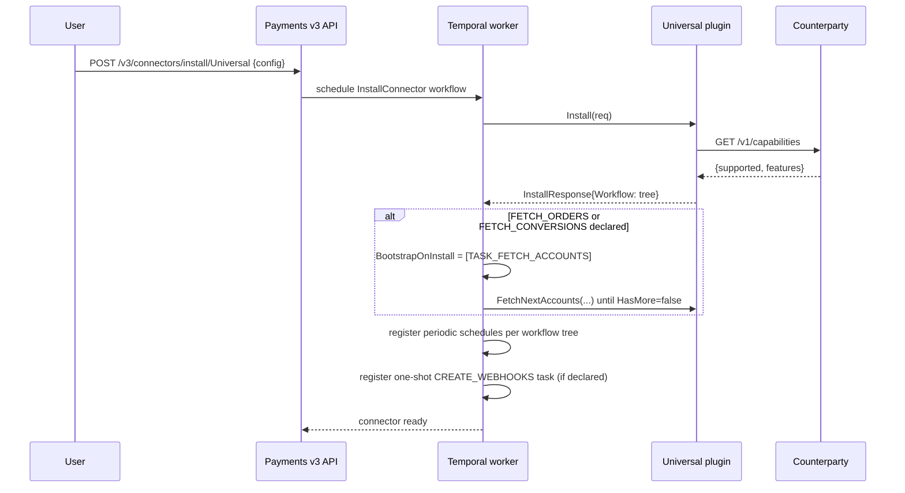
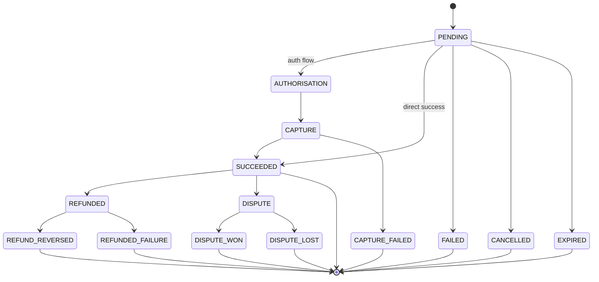
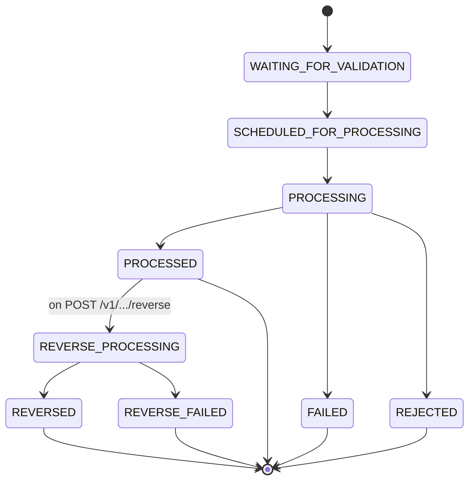
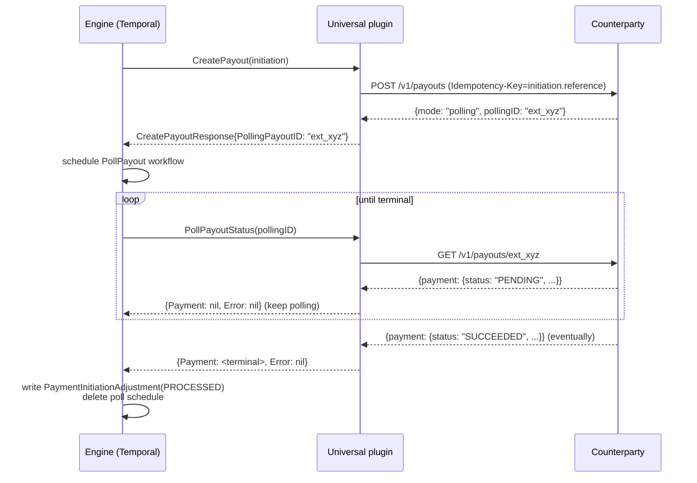
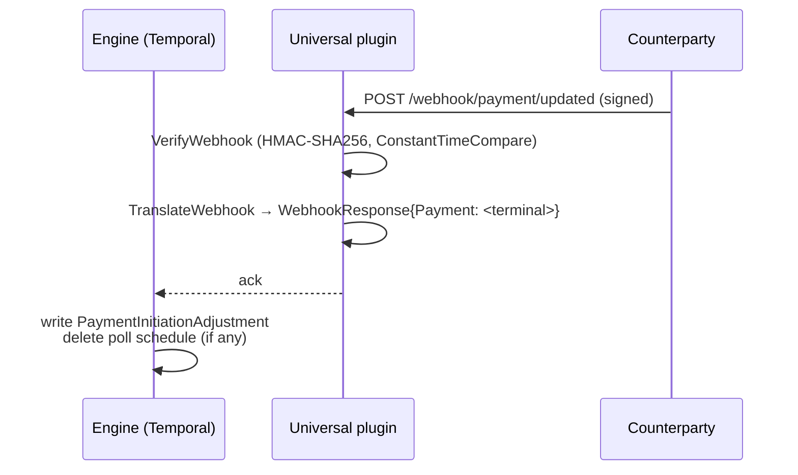
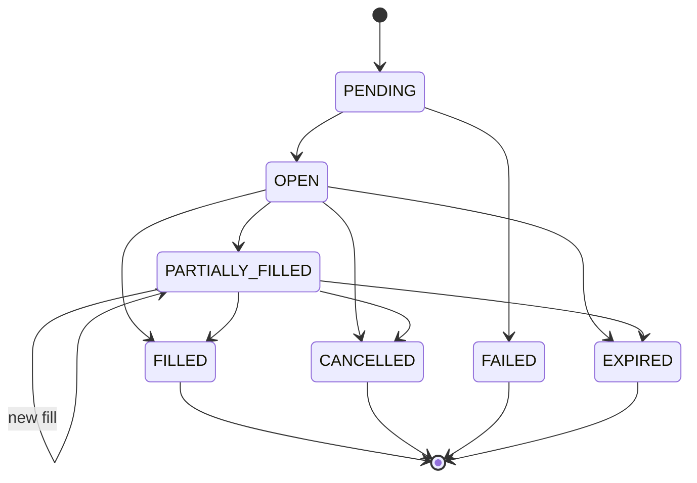
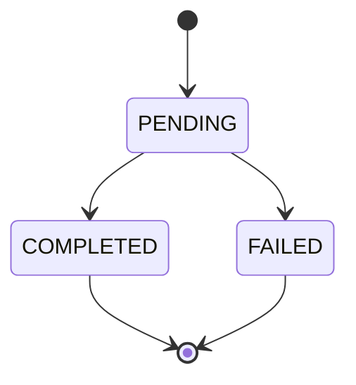

# Universal Connector — State Machines (v1)

> Companion: [`data-model.md`](data-model.md),
> [`adjustments.md`](adjustments.md),
> [`universal-events.md`](universal-events.md).

Every stateful primitive in the contract has two execution paths:

- **Polling** — engine-pulled via the periodic Temporal workflows
  registered at install time.
- **Webhook** — counterparty-pushed via the events catalogued in
  [`universal-events.md`](universal-events.md).

Both paths converge on the same engine state: a webhook is a low-latency
shortcut for what the next poll would have surfaced anyway. Adjustment
dedup (see [`adjustments.md`](adjustments.md)) makes both paths
idempotent — the engine never double-counts.

## Install / bootstrap sequence

The bootstrap branch matches the canonical pattern in
[`internal/connectors/engine/workflow/install_connector.go`](../../../../engine/workflow/install_connector.go)
lines 116–158. We opt into it only when `FETCH_ORDERS` or
`FETCH_CONVERSIONS` is declared, because those primitives reference
accounts at runtime via `AccountLookup`; we don't want the first poll to
race an empty accounts table.

## Payment lifecycle

`PSPPayment.Status` enum from
[`internal/models/payment_status.go`](../../../../models/payment_status.go).

Terminal states do not need to disappear from `GET /v1/payments` — the
counterparty SHOULD continue to serve them, just with a frozen
`updatedAt`. The engine's `updatedAtFrom` cursor will skip them on
subsequent polls.

Every transition emits a [`PaymentAdjustment`](../../../../models/payment_adjustments.go).

## Payout / Transfer initiation lifecycle

Engine-side states from
[`PaymentInitiationAdjustmentStatus`](../../../../models/payment_initiation_adjustments_status.go).
The counterparty does not see these directly; they are derived from the
PSP `PaymentStatus` returned on each poll.

### Polling path

Synchronous failure path: any `GET /v1/payouts/{id}` may return `error: "..."`
to drop the poll and write a `FAILED` adjustment. The polling workflow itself
is in [`internal/connectors/engine/workflow/poll_payout.go`](../../../../engine/workflow/poll_payout.go).

### Webhook path (equivalent)

Both paths converge on the same `(reference, status)` adjustment dedup,
so receiving both a webhook AND a successful poll for the same transition
is harmless.

## Order lifecycle

`PSPOrder.Status` enum from
[`internal/models/order_status.go`](../../../../models/order_status.go):

Note the self-loop on `PARTIALLY_FILLED`: the adjustment dedup key
includes `BaseQuantityFilled`, so each new fill while staying in the same
status produces a fresh adjustment.

## Conversion lifecycle

No adjustment history (latest-wins). The engine refetches the same record
on every poll until the status is terminal.

## Replay / dedup invariants

These three rules let us run polling and webhooks side-by-side without
double-counting:

1. **Idempotency-Key on every POST**: counterparty MUST dedup. The plugin
   uses the entity's natural reference (initiation reference, bank-account
   UUID, event-name + connector) as the key.
2. **Adjustment dedup keys**:
   - `PaymentAdjustmentID` = `(payment.reference, status, amount)`
   - `OrderAdjustmentID` = `(order.reference, status, baseQuantityFilled, fee, feeAsset)`
   - `PaymentInitiationAdjustmentID` = `(initiation.reference, createdAt, status)`
3. **`updatedAt` strictly increasing per record**: the engine's
   `updatedAtFrom` cursor is a high-watermark; non-monotonic timestamps
   cause records to be silently skipped on the next pass.

If your counterparty satisfies all three, you can safely run both polling
and webhooks at the same time, retry deliveries indefinitely, and replay
historical events without corrupting state.
