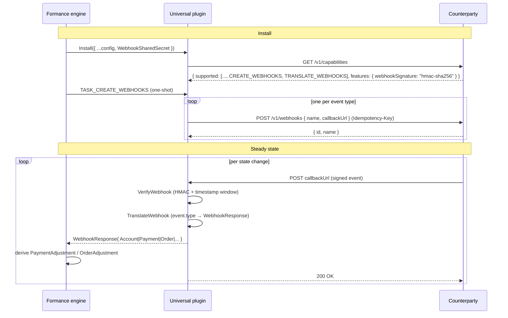

# Universal Connector — Webhooks (v1)

> Companion docs: [`universal-events.md`](universal-events.md) (event
> catalogue), [`data-model.md`](data-model.md) (per-resource wire
> schemas), [`adjustments.md`](adjustments.md), and
> [`state-machines.md`](state-machines.md).

This document is the canonical reference for everything webhook-related
in the Universal Connector contract: subscription protocol, delivery
envelope, signing, verification, event semantics, idempotency, retries,
error handling, and how webhooks coexist with polling.

The engine never *requires* a counterparty to expose webhooks — they
are an opt-in capability. But every counterparty that **does** expose
them MUST conform to everything in this document. The plugin has zero
tolerance for envelope drift, signature anomalies, or out-of-catalogue
event types.

## TL;DR



The engine relies on webhooks for **low-latency state propagation**
between polls. With the engine's 20-minute minimum polling period, an
unwebhooked counterparty exposes the engine to up to a 20-minute
adjustment-derivation lag; a webhooked one is observed within seconds.

## Capability gating

Webhooks involve two separate capabilities, and their presence in
`GET /v1/capabilities`'s `supported` list controls the plugin's
behaviour:

| Capability declared            | Behaviour                                                                 |
|--------------------------------|---------------------------------------------------------------------------|
| `CREATE_WEBHOOKS`              | Plugin POSTs to `/v1/webhooks` at install for every event type            |
| `TRANSLATE_WEBHOOKS`           | Plugin's `VerifyWebhook` and `TranslateWebhook` methods are enabled       |
| Both                           | Full webhook mode (recommended for any production install)                |
| Only `CREATE_WEBHOOKS`         | Subscriptions are registered but inbound deliveries are rejected — useless |
| Only `TRANSLATE_WEBHOOKS`      | The plugin will translate events but never registers any subscription — only meaningful if subscriptions are managed out-of-band |
| Neither                        | Webhook code paths are off; engine relies entirely on `FetchNext*` polls  |

Counterparties SHOULD declare both. The mock declares both by default.

## Required configuration

When the counterparty advertises `features.webhookSignature == "hmac-sha256"`,
the plugin's `Config.WebhookSharedSecret` MUST be non-empty — install
fails fast otherwise. The secret is shared OOB (typically generated by
the counterparty's UI/admin API and pasted into the connector config).

It is read by the plugin via `p.config.WebhookSharedSecret`, never
logged, never returned in error messages, and only referenced inside
`VerifyWebhook` for the constant-time signature compare.

## Subscription protocol

### `POST /v1/webhooks`

Plugin → counterparty. One call per event the plugin wants to
subscribe to (the plugin loops over `supportedWebhooks` in
[`webhooks.go`](../webhooks.go)).

```http
POST /v1/webhooks
Authorization: Bearer <apiKey>
Idempotency-Key: <connectorID>:<event>
Content-Type: application/json

{
  "name":        "payment.updated",
  "callbackUrl": "https://payments.formance.example.com/api/payments/v3/webhooks/<connectorID>/payment/updated",
  "metadata":    {}
}
```

Response (200):

```json
{ "id": "sub_xyz", "name": "payment.updated" }
```

Counterparty MUST dedup on `Idempotency-Key`. A retried POST with the
same key MUST return the same `id` (no duplicate subscription
created). The plugin uses `<connectorID>:<event>` as the key, so the
key is unique per (Formance install, event type) pair.

### `DELETE /v1/webhooks/{id}`

Plugin → counterparty. Called at uninstall (and during in-place
re-install if the URL needs to change). 204 on success; 404 on
unknown id is also acceptable (idempotent semantics).

### Catalogue of subscribed events

See [`universal-events.md`](universal-events.md) for the authoritative
list. The current catalogue is **8 events**:

```
account.created          external_account.created
account.updated          balance.updated
payment.created          payment.deleted
payment.updated          payment.cancelled
```

The plugin subscribes to **all** of them at install, regardless of
which ones the counterparty actually emits. This is intentional:
discovering "you can subscribe to events you'll never receive" is
cheap (one POST per event), and avoids brittle config-driven event
selection.

**Orders and conversions are deliberately not webhook-able.** The
engine's `WebhookResponse` struct has no `Order` or `Conversion`
field, so `TranslateWebhook` has no way to surface those resources
back to storage. Adding `order.*` / `conversion.*` to this catalogue
would mean asking the counterparty to send events Formance silently
discards. Orders and conversions are kept on the
`FetchNextOrders` / `FetchNextConversions` polling path; counterparties
that need lower latency for trading flows can shorten the connector's
`pollingPeriod` to the 20-minute floor.

## Delivery envelope

Every body the counterparty POSTs to a registered `callbackUrl` MUST
look like:

```json
{
  "id":        "evt_01HV6BYE7XJ8WDPV7M0F3A4VTC",
  "type":      "payment.updated",
  "createdAt": "2026-05-13T12:34:56.123Z",
  "resource": {
    "payment": {
      "reference":                   "pay_42",
      "createdAt":                   "2026-05-13T11:00:00Z",
      "updatedAt":                   "2026-05-13T12:34:56Z",
      "type":                        "PAYIN",
      "status":                      "SUCCEEDED",
      "amount":                      "12500",
      "asset":                       "EUR/2",
      "destinationAccountReference": "acct_001"
    }
  }
}
```

| Field        | Required | Notes                                                                                                              |
|--------------|----------|--------------------------------------------------------------------------------------------------------------------|
| `id`         | yes      | Globally-unique event id. Used by the engine as the **idempotency key** — replaying the same id is a no-op.        |
| `type`       | yes      | Must be one of the catalogue entries. Unknown types yield a 400 from the plugin.                                   |
| `createdAt`  | yes      | RFC3339 UTC. Informational; not used for ordering — the resource's own `updatedAt` drives the engine's adjustment dedup. |
| `resource`   | yes      | Typed inline payload. Exactly the same wire schema served by the corresponding `GET /v1/...` endpoint.             |

### Required headers

When `features.webhookSignature == "hmac-sha256"`:

| Header                  | Value                                                   |
|-------------------------|---------------------------------------------------------|
| `Content-Type`          | `application/json`                                      |
| `X-Universal-Timestamp` | RFC3339 UTC instant — when the event was signed         |
| `X-Universal-Signature` | Lowercase hex of `HMAC-SHA256(secret, "<timestamp>.<body>")` |

When `features.webhookSignature == "none"` (NOT recommended), the two
`X-Universal-*` headers are optional — but the plugin will log a
warning on every delivery and skip verification.

## Signing recipe

Pseudocode every counterparty implementation should follow:

```python
import hmac, hashlib, time, json

def sign_event(secret: str, body: bytes) -> dict:
    ts   = time.strftime("%Y-%m-%dT%H:%M:%SZ", time.gmtime())
    msg  = f"{ts}.".encode() + body
    sig  = hmac.new(secret.encode(), msg, hashlib.sha256).hexdigest()
    return {
        "X-Universal-Timestamp": ts,
        "X-Universal-Signature": sig,
        "Content-Type": "application/json",
    }
```

```go
import (
    "crypto/hmac"; "crypto/sha256"; "encoding/hex"; "time"
)

func sign(secret string, body []byte) (string, string) {
    ts := time.Now().UTC().Format(time.RFC3339)
    mac := hmac.New(sha256.New, []byte(secret))
    mac.Write([]byte(ts))
    mac.Write([]byte("."))
    mac.Write(body)
    return ts, hex.EncodeToString(mac.Sum(nil))
}
```

```javascript
import { createHmac } from "node:crypto";

function sign(secret, body) {
  const ts = new Date().toISOString().replace(/\.\d+/, "");
  const sig = createHmac("sha256", secret)
    .update(`${ts}.`)
    .update(body)
    .digest("hex");
  return { "X-Universal-Timestamp": ts, "X-Universal-Signature": sig };
}
```

The plugin's verification side mirrors this in
[`webhooks.go`](../webhooks.go) `verifyHMACSHA256` — the canonical
implementation, using `subtle.ConstantTimeCompare`.

### Why this scheme

- **Timestamp prefix** prevents body-replay attacks: a captured
  request can't be re-sent later because the timestamp is outside the
  tolerance window (±5 minutes).
- **Lowercase hex** is the universal lingua franca — easy to debug in
  logs, no base64 padding ambiguity.
- **Constant-time compare** on the verify side defeats timing-attack
  classes that distinguish "wrong byte at position 0" from "wrong byte
  at position N".

## Verification (plugin side)

Implemented by `(*Plugin).VerifyWebhook` in
[`webhooks.go`](../webhooks.go). Sequence per inbound delivery:

1. Reject if the plugin's declared capability set doesn't include
   `TRANSLATE_WEBHOOKS` (returns `plugins.ErrNotImplemented`).
2. Skip verification (with a logged warning) if `features.webhookSignature == "none"`.
3. Read both signature headers. If either is missing → `401`.
4. Parse `X-Universal-Timestamp` as RFC3339 UTC. If the difference
   from `time.Now()` exceeds **5 minutes** in either direction → `401`
   "timestamp outside tolerance window". Both forward (clock skew) and
   backward (replay) are blocked.
5. Compute the expected HMAC over `<timestamp>.<body>` with the
   shared secret.
6. Decode the inbound `X-Universal-Signature` from hex.
7. Compare the two byte-slices with `subtle.ConstantTimeCompare`.
   Mismatch → `401` "invalid webhook signature".
8. On success, parse the body as `WebhookEvent`. Use `event.id` as the
   `WebhookIdempotencyKey` so the engine's outbox can dedup.

The plugin **never** echoes signature data, secret hints, or event
contents back in the 401 response — verification failures are opaque.

## Translation (plugin side)

Implemented by `(*Plugin).TranslateWebhook` in
[`webhooks.go`](../webhooks.go). Sequence:

1. Reject if `TRANSLATE_WEBHOOKS` capability isn't declared.
2. Reject if `event.type` isn't in the catalogue (`supportedWebhooks`
   map).
3. Decode the body into a `client.WebhookEvent`.
4. Dispatch on `event.type` via `translateResource`:

| Event type                 | Builds                                                       |
|----------------------------|--------------------------------------------------------------|
| `account.created`/`.updated` | `WebhookResponse.Account`                                  |
| `external_account.created` | `WebhookResponse.ExternalAccount`                            |
| `balance.updated`          | `WebhookResponse.Balance`                                    |
| `payment.created`/`.updated` | `WebhookResponse.Payment`                                  |
| `payment.deleted`          | `WebhookResponse.PaymentToDelete = { Reference }`            |
| `payment.cancelled`        | `WebhookResponse.PaymentToCancel = { Reference }`            |
| anything else              | `400` with "unsupported webhook event" (incl. `order.*` / `conversion.*` — see "Catalogue of subscribed events") |

If the required `resource.<field>` is missing in the body, the plugin
returns a clear error so the counterparty can self-diagnose
("payment.updated requires resource.payment").

The engine then uses the returned `WebhookResponse` exactly the same
way it uses `FetchNext*` results — running it through
`FromPSPPayment`/`FromPSPOrder`/etc. to derive an adjustment.

## Engine-side semantics

What the engine does with each event type, beyond storing the resource:

| Event                       | Engine consequence                                                        |
|-----------------------------|---------------------------------------------------------------------------|
| `account.*`                 | Upserts the `Account` row in storage. Triggers a `Balance` refresh if the account has changed asset.|
| `external_account.created`  | Upserts as an external `Account` (Type=EXTERNAL). Does NOT trigger balance fetch. |
| `balance.updated`           | Inserts a `Balance` row. Latest-wins; no adjustment history.              |
| `payment.created`/`updated` | Upserts the `Payment`. Derives a new `PaymentAdjustment` if the dedup key (reference, status, amount) differs from the last stored adjustment. |
| `payment.deleted`           | Removes the `Payment` row from storage.                                   |
| `payment.cancelled`         | Marks the `Payment` as cancelled; engine derives a `CANCELLED` adjustment. |

## Idempotency and retry semantics

- The `id` field on every event is the **engine-side idempotency
  key**. The engine writes `WebhookIdempotencyKey = event.id` so the
  outbox can drop duplicates.
- **Retry policy**: counterparty MUST retry deliveries that yield 5xx
  or network-level failures. Exponential backoff with jitter is
  recommended (e.g. 1s, 5s, 25s, …, capped at 1 hour, total cap 24
  hours).
- **At-least-once delivery is safe.** Replaying the same `id` is a
  no-op. Replaying a different `id` for the same logical state change
  is **also** safe because the engine's adjustment dedup keys on the
  underlying `(reference, status, ...)` tuple, not the event id —
  duplicate semantic deliveries collapse on the adjustment side.
- **Re-ordering tolerance is implementation-defined.** The engine's
  adjustment derivation is based on the resource's `updatedAt`
  timestamp, not delivery order. So a `SUCCEEDED` event delivered
  before a `PENDING` event with an earlier `updatedAt` will still
  produce the correct adjustment trail.

## Error responses (plugin → counterparty)

| Status | Meaning                                                          | Counterparty SHOULD                                          |
|--------|------------------------------------------------------------------|--------------------------------------------------------------|
| 200    | Accepted and processed                                           | Stop retrying                                                |
| 400    | Bad envelope, unknown event type, missing required resource      | Fix the payload; do NOT retry until then (this is permanent) |
| 401    | Authentication / signature failed                                | Check `WebhookSharedSecret` configuration; do NOT retry      |
| 5xx    | Engine downtime or unexpected error                              | Retry with the same `id` per the policy above                |

The plugin never returns a body on 401 to avoid leaking signature
hints. 400 responses include a brief textual reason ("payment.updated
requires resource.payment") so the counterparty can self-diagnose.

## Webhooks vs polling

Both paths exist intentionally:

- Webhooks: low latency, used as the primary signal in webhook-mode.
- Polls: every `pollingPeriod` (≥ 20 min), used as the safety net
  ("did we miss any events?") and as the only signal when no webhooks
  are subscribed.

When BOTH are active, the engine sees each state change twice (once
via webhook, once via the next poll). This is **safe** because
adjustment dedup converges — same `(reference, status)` tuple ⇒ no
new adjustment row. So counterparties don't need to suppress
duplicates.

The mock counterparty under [`../mock/`](../mock/) gates poll-driven
evolution on whether webhooks are subscribed (see
[`mock/README.md`](../mock/README.md) "Driving adjustments"), so the
two paths don't both fight to advance the dataset.

## Testing recipes

### From the mock binary

The mock auto-emits a matching webhook for every record advanced via
`/_admin/evolve` IF a subscription exists for the corresponding event
type:

```bash
# Subscribe a sink to payment.updated.
curl -sS -X POST http://localhost:8080/v1/webhooks \
  -H 'Authorization: Bearer dev-key' \
  -H 'Idempotency-Key: my-key' \
  -H 'Content-Type: application/json' \
  -d '{"name":"payment.updated","callbackUrl":"http://my-engine.local/webhook"}'

# Advance 20 records — the mock auto-pushes a signed payment.updated
# event for each evolved payment to the registered callback.
curl -sS -X POST -H 'Authorization: Bearer dev-key' \
  'http://localhost:8080/_admin/evolve?n=20'
# → {"advanced":20,"webhooksDelivered":7}
```

For a single synthetic event without evolving:

```bash
curl -sS -X POST -H 'Authorization: Bearer dev-key' \
  'http://localhost:8080/_admin/trigger-webhook?name=payment.updated'
```

Both paths use the same envelope shape, signing scheme, and HMAC
secret as production deliveries.

### Unit tests in your own counterparty

Verify your signing matches the plugin's by replicating the recipe in
[`mock/server.go`](../mock/server.go) `signHMAC` and posting against
`(*Plugin).VerifyWebhook`. The mock's `server_test.go` includes
`TestAdminTriggerDeliversSignedPayload` and
`TestAutoEmitWebhookOnEvolveDeliversSignedEvents` as worked examples.

## WebSocket transport (`features.eventStream == "wss"`)

For counterparties that want lower-latency push than HTTP webhooks, the
contract reserves `GET /v1/stream` as a WebSocket endpoint. Frames are
the same `WebhookEvent` envelope as HTTP webhooks — TranslateWebhook is
reused without modification. See [`universal-openapi.yaml`](universal-openapi.yaml)
operation `openStream` for the wire contract.

### When to use it

- Real-time PSPs that already publish events on WebSockets natively (most
  crypto exchanges, some FX venues).
- Anywhere webhook delivery latency over the public internet would miss
  business SLAs (sub-second status propagation).
- Anywhere the counterparty controls connectivity to Formance (outbound-
  only connections; no inbound HTTP exposure required).

HTTP webhooks remain available and complementary: the periodic
`FetchNext*` polls continue to backfill any events lost during a WS
outage. The two transports never deliver to the same install
simultaneously — when the supervisor is connected, the mock (and any
contract-conformant counterparty) routes events to the stream
**instead of** the HTTP callback for that subscription.

### Handshake auth

Every connect AND reconnect is signed. One signing primitive across HTTP
webhooks and WS handshakes — same `WebhookSharedSecret`, same HMAC-SHA256
algorithm, same 5-minute timestamp tolerance.

Signed payload: `<timestamp>.<nonce>.<canonicalEventsJSON>`. The
counterparty must:

1. Match `apiKey` against the bearer.
2. Reject `timestamp` outside ±5 min skew.
3. Reject `nonce` if seen in the last 10 min (TTL cache).
4. Recompute the HMAC with the connector's `WebhookSharedSecret` and
   constant-time compare.

Any failure → close 1008 (Policy Violation) with a descriptive reason so
the client's reconnect logs are diagnosable. The client backs off on
1008 just like on transport errors; persistent 1008 indicates operator
misconfiguration (wrong secret on the connector vs counterparty).

### Subscription model

The plugin sends an explicit `events: [...]` list in the hello frame.
It is derived from the intersection of:

- `features.streamEvents` declared at `/v1/capabilities` (the sentinel
  `["*"]` means "everything I publish on webhooks I also publish on the
  stream").
- The plugin's static `supportedWebhookNames` map (everything the engine
  can route via `TranslateWebhook`).

Empty intersection while `features.eventStream == "wss"` fails install
with `ErrInvalidConfig` — silent "nothing to subscribe to" is exactly
the kind of misconfiguration that should bite at install, not on the
first event.

### Multi-pod safety

The plugin opens one WS per worker pod. Counterparties that advertise
`wss` MUST emit a stable event `id` so the engine's
`WebhookIdempotencyKey` dedup absorbs duplicate deliveries from N pods
without double-processing. This is the cheap version of leader election;
Phase 2 may add a Postgres advisory lock for cost reduction once the
pattern is in production.

### Counterparty obligations (MUST)

- Validate timestamp tolerance, nonce freshness, signature.
- Close with 1008 on auth failure (so the client backs off).
- Track nonces for ≥ 10 min.
- Rate-limit per-installation connect attempts (e.g. 1 / 10 s) to defend
  against reconnect storms during rolling deploys.
- Emit stable event ids for cross-pod dedup.

### Implementation references

- Plugin WS client: [`../client/stream.go`](../client/stream.go) — `DialStream`, `SignHello`, `StreamClient`.
- Plugin supervisor: [`../stream.go`](../stream.go) — `streamSupervisor`, `resolveSubscribeList`, `backoff`.
- Mock WS server: [`../mock/stream.go`](../mock/stream.go) — `handleStream`, `acceptHello`, `streamHub`, `nonceCache`.

## Implementation references

- Plugin webhook code: [`../webhooks.go`](../webhooks.go) — `CreateWebhooks`, `VerifyWebhook`, `TranslateWebhook`, `verifyHMACSHA256`, `headerValue`.
- Wire shapes: [`../client/types.go`](../client/types.go) — `WebhookEvent`, `WebhookResource`, `WebhookSubscriptionRequest/Response`.
- Mock counterpart: [`../mock/server.go`](../mock/server.go) — `handleCreateWebhookSub`, `handleAdminTrigger`, `handleAdminEvolve`, `evolveAndDeliver`, `signHMAC`.
- Engine-side translation: [`internal/connectors/engine/activities/plugin_translate_webhook.go`](../../../../engine/activities/plugin_translate_webhook.go).
